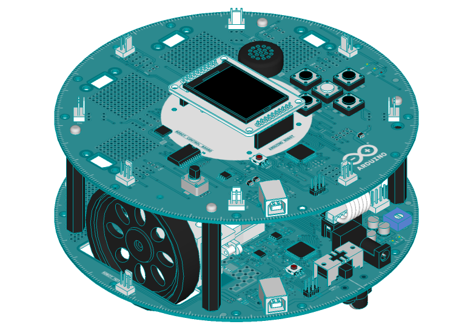

# ROS for Arduino Robot
*Control your Arduino Robot with ROS*

# Introduction

The Arduino robot is the first Arduino on wheels, see: https://www.arduino.cc/en/guide/robot 



The Arduino Robot. Copyright: *arduino.cc*


Unfortunately this robot is retired now, but if you might still have one, it is be fun to use it with ROS:-)

http://wiki.ros.org/noetic

# The Robot

The robot consists of two boards. To control it from ROS, the original firmware for the motor board will work. For the control board a *rosserial_arduino* client should run for publishing and subscribing of ROS topics. The USB connector from the control board forms the serial interface and it can, for instance, be connected to a single board computer carried by the robot.

Unfortunately, the standard Robot Control library uses too much resources to leave enough free memory space to run a *rosserial_arduino* client. A stripped down version of the Robot Control library can be found here: https://github.com/MartinStokroos/Robot_Control_Lite

# ROS lib for Arduino

The ROS library for Arduino can be installed via the Arduino IDE library manager, or the library can be generated with a Python script from the *ros-noetic-rosserial-arduino* package. Modify *ros.h* by adding support for the Atmega32u4 MCU.

Add under "namespace ros":

````
```
#elif defined(__AVR_ATmega32U4__)

  typedef NodeHandle_<ArduinoHardware, 2, 2, 150, 150> NodeHandle;

```
````

The NodeHandle arguments are: *number of publishers, number of subscribers, input buffer size, output buffer size*. Always keep an eye on the available free memory after compiling the sketch for the robot ( use <80% for stable operation ).

# The Sketch

- Robot_Control_ROS.ino

 Current topics:

* cmd_vel

  (raw PWM values. No calibration yet..)

* msg_compass

  (compass heading 0...360 degrees)


This work is under development...


